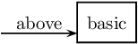
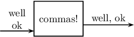
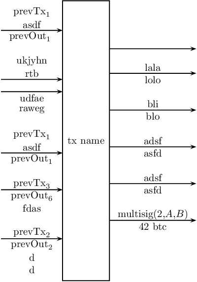

Utility for drawing a box with arbitrary incoming and outgoing arrows. Useful
for drawing transactions that follow the UTXO model (e.g. Bitcoin).

1. [Usage](#usage)
    1. [Special cases](#special-cases)
    1. [Setup](#setup)
1. [Full-fledged example](#full-fledged-example)
1. [Addendum](#addendum)

## Usage

```latex
\usepackage{txfig}

\begin{pspicture}
\drawtx{<text in box>}
{ % inputs
  { % 1st input
    { % text above 1st input
      <1st line above first input>,
      <2nd line above first input>,
      <...>,
      <n-th line above first input>% <- this comment symbol is needed
    },
    { % text below 1st input
      <1st line below first input>,
      <2nd line below first input>,
      <...>,
      <m-th line below first input>
    }% <- this comment symbol is needed
  },
  ... % more comma-separated inputs
  { % last input
     {<>, <>, ..., <>}, {<>, <>, ..., <>}% <- this comment symbol is needed
  }% <- this comment symbol is needed for last input
}
{ % outputs follow the same syntax as inputs
  ...
}
\end{pspicture}
```

Math mode can be used without limitation. [`full.tex`](examples/full.tex) is provided and
can be used as a template.

### Special cases

Even if you only need one line e.g. above an input, you still have to do this:
```latex
\drawtx{basic}
  {{{above},{}}}{}
```

This would create the following:



Since commas (`,`) are special characters, for an actual comma to be printed in the text
it has to be wrapped with braces (`{,}`), e.g. this:
```latex
\drawtx{commas!}
  {{{well, ok},{}}}
  {{{well{,} ok},{}}}
```

gives a different input and output:



You have to ~~love~~ tolerate braces.

### Setup

The following packages are required: `pstricks`, `pst-node`, `auto-pst-pdf`, `amssymb`,
`calc`, `pgffor`, `xparse`, `expl3`, `fp`, `etoolbox`, `xifthen`.

To use, copy [`txfig.sty`](txfig.sty) to your project directory (or install it with your
preferred method) and add `\usepackage{txfig}` before using `\drawtx`. If you compile with
`pdflatex`, you need to add the `--shell-escape` option, needed by PSTricks, e.g.:

```sh
pdflatex --shell-escape main.tex
```

## Full-fledged example

```latex
\documentclass{article}

\usepackage{txfig}

\begin{document}
\begin{figure}
\begin{pspicture}
  \drawtx{tx name}{
    {
      {$\mathrm{prevTx}_1$,asdf},
      {$\mathrm{prevOut}_1$}
    },
    %{{ukjyhn,rtb}}, not allowed
    {{ukjyhn,rtb},{}},
    {{},{udfae,raweg}},
    {{$\mathrm{prevTx}_1$,asdf},{$\mathrm{prevOut}_1$}},
    {{$\mathrm{prevTx}_3$},{$\mathrm{prevOut}_6$,fdas}},
    {{$\mathrm{prevTx}_2$},{$\mathrm{prevOut}_2$,d,d}}%
  }{
    {{}}, % no text around this arrow
    {{lala},{lolo}},
    {{bli},{blo}},
    {{adsf},{asfd}},
    {{adsf},{asfd}},
    {{$\mathrm{multisig}(2{,}A{,}B)$},{$42$~btc}}%
  }
\end{pspicture}
\end{figure}
\end{document}
```



## Addendum

(La)TeX is a horrible abomination that should be wiped clean from the face of earth.
